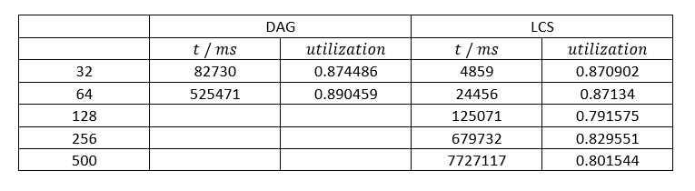
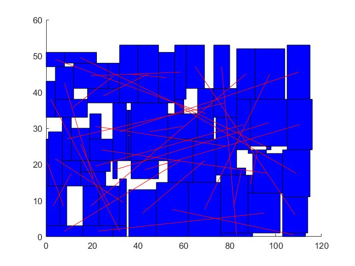
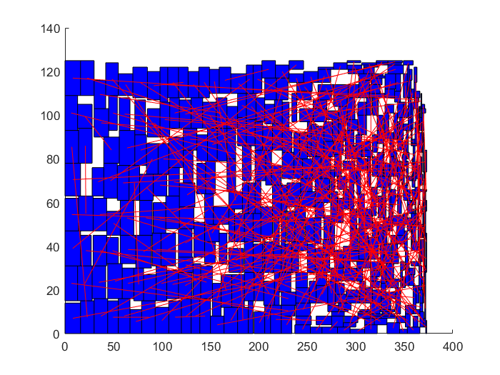
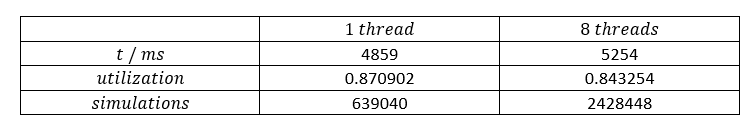

# Sequence Pair Project
6/17/2018 7:55:21 PM  李依林 2016011502

## Readme

### 概述

* 项目由4个部分组成：求解器（`bin/run_packer.exe`），随机生成器（`bin/generate_testcase.exe`），Boost.Test测试项目（`bin/boost_test.exe`），以及用于可视化的MATLAB脚本（`src/draw_rects_from_files.m`）。
* 提供了makefile的命令简化对这些程序的调用。
* 如果编译器和库的版本不完全匹配，有可能出现无法编译的情况（具体来说是C++的`<thread>`库，我的g++和Qt的C++库就遇到了这样的问题），如果能够运行所提供的可执行文件就建议不要重新编译了。
* 程序需要include boost库，如果需要编译请修改makefile中的`BOOSTDIR`变量（不保证一定能通过编译）

### 求解器
* 考虑到如果要处理真实问题，应该能让程序处理指定的矩形和指定的连线，故而主程序从命令行读入矩形文件、连线网络的文件、并将布局结果保存到指定的文件中。
* 尝试基于Boltzmann分布对模拟退火进行多线程扩展，可以运行时指定线程数（尽管模拟退火并不是一个具有并行结构的问题，应该说最终效果没有达到预期）
* 求解器输入矩形文件（`testcase/rectXX.txt`）、连线网络文件（`testcase/netXX.txt`）后，会生成`testcase/layoutXX-YY-ZZ-WW`文件，其中`XX`代表矩形的个数，`YY`代表选择的`alpha`值，`ZZ`代表算法的策略（`dag`是使用Boost.Graph库的版本，`lcs`是改进的版本），`WW`代表选择的线程数。
* 如何调用单次测试：`make run_packer n=64 alpha=1.0 method=lcs thrds=1`（其中`n`是矩形的个数，应当已经在`testcase`中生成相应的问题；`alpha`是评价函数的权重；`method`为`dag`或`lcs`；`thrds`为线程数目，取1时为单线程的版本。
* 如何对所有默认的矩形个数 (32, 64, 128, 256, 500) 运行测试：`make autorun alpha=1.0 thrds=1`（如果使用mingw32-make，相应地使用`mingw32-make mingw32_autorun alpha=1.0 thrds=1`）
* 实际上模拟退火的参数和输出等级也可以调整，在此不作过多说明，如有需要可参考`bin/sa_options.txt`及`bin/run_packer.exe`的提示信息使用自定义的参数。

### 随机生成器
* 生成默认大小的testcases (32, 64, 128, 256, 500): `make make_testcases`
* 生成指定大小的testcase: `make make_testcase n=233`

### Boost.Test
* 用Boost.Test库对程序内部实现作正确性检查，调用方式: `make boost_test`

### MATLAB脚本
* 提供了MATLAB脚本对求解的结果进行可视化。在MATLAB shell环境下切换到`src`目录，调用`draw_rects_from_file('../testcase/layoutXX-YY-ZZ-WW.txt', '../testcase/netXX.txt')`，其中文件名的意义参见求解器部分的说明。

----------

此外还有一些makefile的命令，可通过`make help`查看。

## 工作概述

首先是问题要求的用Boost库改写最长道路，以及用LCS来实现sequence pair的evaluation。后者实现的时间复杂度是`O(nlogn)`。解的正确性在程序末尾验证。

为了进一步提高性能，设法基本避免了频繁动态分配内存（除了Boost.Graph最长路径的算法，尚不确定这是否是可能的），部分是通过引入Allocator实现的（而Allocator通过MemorySource分配内存，机制参见C++17的`polymorphic_allocator`）。为了提高性能，也为了练习模板，将原先代码用模板重新组织。此外，一个细节上的调整是：原先`Layout`存储的是`Rect`的数组，但是实际上分别存储横纵坐标、宽度、高度的数组更加合适。这是由于算法是对横纵分量分别运算，存储为“struct of arrays”而不是“array of structs”能更好地利用cache。

实现中模拟退火基于接受率确定起始和终止温度，温度指数下降，每轮模拟次数根据矩形个数选定，并引入了能量过高时的restart机制。

模拟退火的测试表明，论文中提及的邻域选择方式效果并不好（课堂上也有同学指出了这一点）。实际上sequence pair的表示和TSP的解类似，都是[0, n)的一个排列。参考典型的TSP的模拟退火求解方式，我测试了以下的邻域选取策略（记两个sequence pair为x, y；略去了旋转90°的交换，它对于问题的P-admissibility是必要的）：

1. 交换x中两个元素
2. 交换y中两个元素
3. 同时交换x，y中两对元素
4. 转置x的一个子序列
5. 转置y的一个子序列
6. 同时转置x, y的一对子序列
7. 将x的一个子序列循环左移
8. 将y的一个子序列循环左移
9. 将x，y的一对子序列循环左移

前期测试结果表明，综合使用后6种交换方式效果较好，而原先论文中提及的1，3会导致较低的utilization。

下面给出使用DAG和LCS两种方法对于给定的矩形个数的运行结果。为了简化分析，取`alpha=1.0`，即只考虑面积最小化的情形。（注：由于选择的每轮的模拟次数是`max(30n, 1024)`，模拟时间是`O(n^2logn)`；基于DAG的版本运行时间过长，故只测了矩形较少的情形。）

* 64个矩形

* 500个矩形

在此基础上，我试图对模拟退火这个不易并行的算法作多线程扩展（使用较新标准的C++线程库）。使用的方法与文献[1](https://link.springer.com/article/10.1007%2Fs10898-007-9138-0)中的方法v2，v3类似但并不相同。基本想法是：让每个温度下有多个粒子并行模拟，从而在每轮模拟的马尔可夫链足够长的前提下，适当减少一些每个粒子的模拟次数。在每个温度下模拟结束时，通过各个线程的模拟情况确定下一轮粒子的初始情况。问题是，怎样选取才能不破坏Metropolis准则呢（如果直接取最小值就会破坏之）？我尝试的方法是：仿照Boltzmann分布，根据各线程例子终态能量确定Boltzmann因子以及“配分函数”，计算各线程粒子终态被选中的概率，从而随机决定下一轮各粒子的初始状态。

* 32个矩形（LCS）

由于实现中较为仔细地实现了线程通信，避免了动态fork / join线程，就模拟次数而言程序的并行效率较高。但遗憾的是，这样做可能仍然破坏了原先模拟退火的性质，utilization反而有所下降。一个可能的改进方式是[1](https://link.springer.com/article/10.1007%2Fs10898-007-9138-0)，在各线程模拟完成后，运行一定代数的遗传算法，从而确定下一轮粒子的初始状态。实际上，代码中的并行方式可以看成取遗传算法的适应性函数为`exp(-E / T)`，且遗传代数为0的特殊情况。由于时间所限，没有进一步尝试。然而为何基于Boltzmann分布的并行方式会造成utilization的下降，仍然是一个值得思考的问题。

## 参考资料

[1]. Parallelizing simulated annealing algorithms based on high-performance computer 
[https://link.springer.com/article/10.1007%2Fs10898-007-9138-0](https://link.springer.com/article/10.1007%2Fs10898-007-9138-0)

